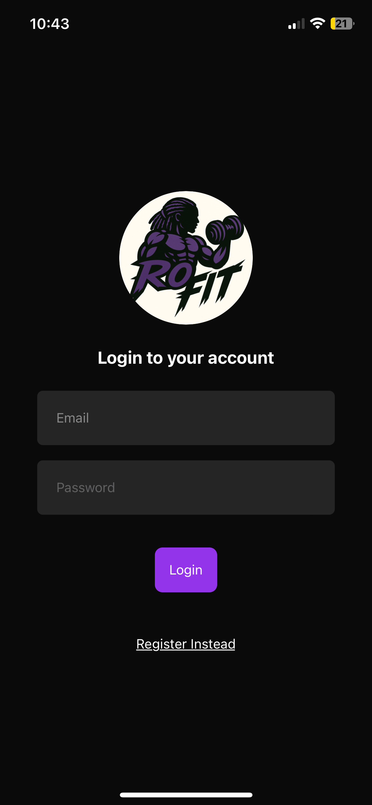
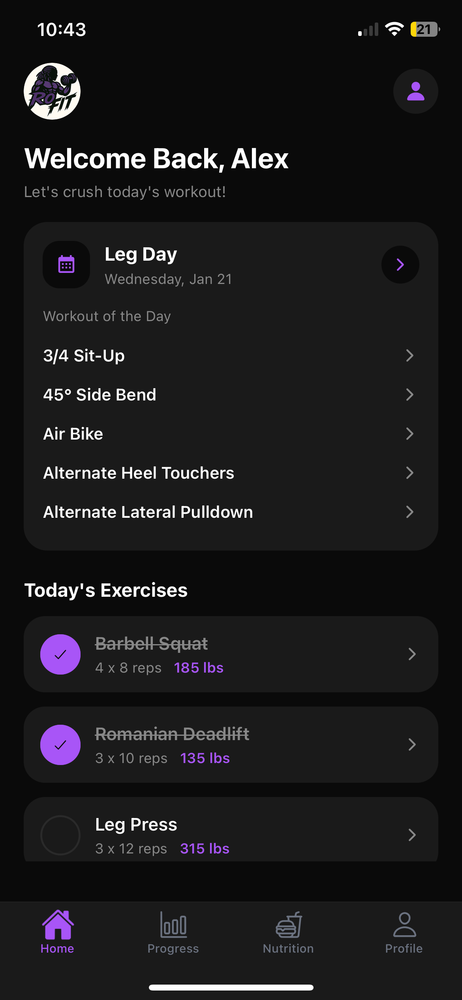
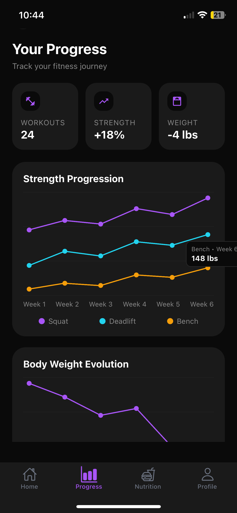
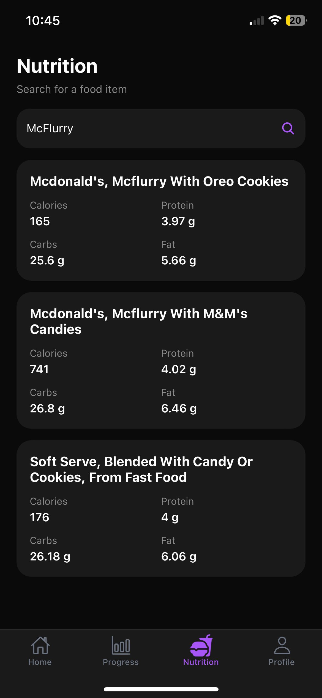

# TP2 - Fitness App - RoFit

Une application mobile de fitness simple et claire.  
Elle propose un **Home** avec des exercices animés, un **Progress** avec graphiques interactifs, un **Profile** complet avec mode clair/sombre et logout, et un onglet **Nutrition** pour suivre ses macros.

---

## Aperçu rapide

- **Home** : “Workout of the Day” avec **exercices animés (GIFs/illustrations)** + liste d’exercices du jour  
- **Progress** : cartes statistiques + graphiques d’évolution pour voir tes résultats selon la période
- **Profile** : infos personnelles + mode clair/sombre + logout  
- **Nutrition** : recherche d’aliments + calories, protéines, glucides, lipides (USDA)

---

## Prérequis

- Node.js (version récente)
- Expo CLI (via `npx expo`)

---

## Installation

```bash
npm install
```

---

## Configuration (.env)

Crée un fichier `.env` à la racine du projet avec :

```bash
EXPO_PUBLIC_RAPIDAPI_KEY=VOTRE_CLÉ_ICI
EXPO_PUBLIC_USDA_KEY=VOTRE_CLÉ_ICI
```

---

## Lancer le projet

```bash
npm start
```

Optionnel :

```bash
npm run android
npm run ios
npm run web
```

---

## Structure (simplifiée)

```
app/
  (auth)/
  (dashboard)/
components/
context/
hooks/
services/
```

---

## APIs utilisées

- **ExerciseDB (RapidAPI)** : Home + détail exercice avec GIFs/animations pour montrer comment faire correctement l’exercice  
- **USDA FoodData Central** : Nutrition (calories, protéines, glucides, lipides)

---

## Screenshots







---

## Notes

- Le mode **clair/sombre** est géré via un ThemeContext.
- Les captures d’écran sont à ajouter dans le dépôt Git.

---

## Auteur

Tarik A